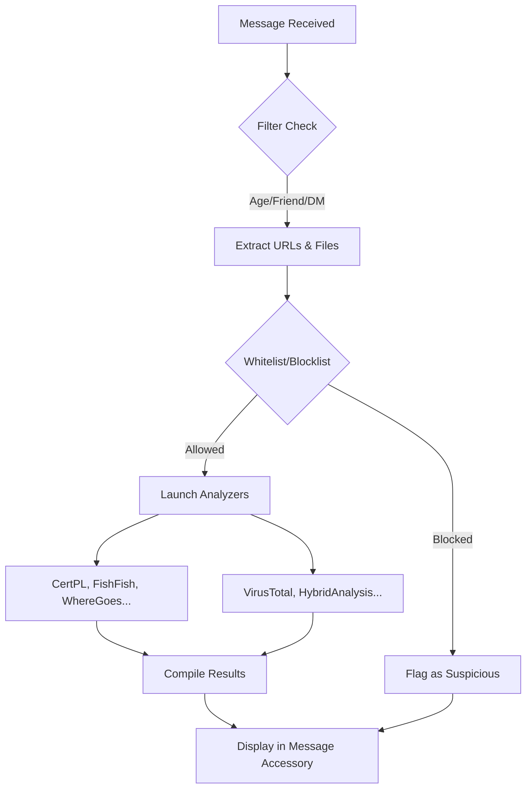

# vAnalyzer

> Security plugin for [Vencord](https://vencord.dev/) designed to analyze links, files, and user/server context within Discord.

> We know that Discord has a built-in analyzer, but this expands the possibilities 

 

---

# How To Install

### src/userplugins folder

> https://docs.vencord.dev/installing/#installing-your-custom-build
> 
> https://docs.vencord.dev/installing/custom-plugins/

---

## Quick Summary

vAnalyzer combines three layers:

1. **Manual analysis** from context menus
2. **Automatic analysis** when messages arrive (based on configuration)
3. **Visual enrichment** inside the message (results accessory)

Features: whitelists/blacklists, local caching and custom modules to connect your own endpoints.

---

## Architecture

---

## Main Features

| Feature | Description | Where Used |
| --- | --- | --- |
| Manual context menus | On-demand scanning of URLs, attachments, invites, users | Messages, users, servers |
| Auto-analysis | Automatic analysis when messages arrive | MESSAGE_CREATE flow |
| Link click warning | Alert on flagged domains | Link click interception |
| Message age filter | Ignore old messages by days | Auto-analysis |
| DM-only mode | Limit auto-scan to direct messages | All analyzers |
| Skip friends | Avoid scanning friend messages | Auto-analysis |
| Ignore media files | Skip image/video/audio files | File auto-scan |
| Whitelist/blocklist | Exclude/flag domains | URL pipeline |
| FMHY auto-update | Fetch unsafe sites list | Blocklists |
| OSINT shortcuts | Search User / Search Server | User/server contexts |
| Modular Scan | Custom HTTP endpoints | URL/file analysis |
| Connected members | Public widget member list | Discord invite results |

---

## Built-in Modules

| Feature | Description | Where Used |
| --- | --- | --- |
| Manual context menus | On-demand scanning of URLs, attachments, invites, users | Messages, users, servers |
| Auto-analysis | Automatic analysis when messages arrive | MESSAGE_CREATE flow |
| Link click warning | Alert on flagged domains | Link click interception |
| Message age filter | Ignore old messages by days | Auto-analysis |
| DM-only mode | Limit auto-scan to direct messages | All analyzers |
| Skip friends | Avoid scanning friend messages | Auto-analysis |
| Ignore media files | Skip image/video/audio files | File auto-scan |
| Whitelist/blocklist | Exclude/flag domains | URL pipeline |
| FMHY auto-update | Fetch unsafe sites list | Blocklists (every 4d) |
| OSINT shortcuts | Search User / Search Server | User/server contexts |
| Modular Scan | Custom HTTP endpoints | URL/file analysis |
| Connected members | Public widget member list | Discord invite results |

---

## Built-in Modules

### Base Analyzers

| Module | Type | Output | API Key Required |
| --- | --- | --- | --- |
| CertPL | Domain | Blocklist status | ✅ No |
| FishFish | Domain | Phishing check | ✅ No |
| WhereGoes | URL | Redirect chain | ✅ No |
| Sucuri | Domain | Reputation rating | ✅ No |
| CrtSh | Domain | Certificate history | ✅ No |
| DiscordInvite | Invite | Server info + widget | ✅ No |
| BotProfile | Bot | Account status | ✅ No |
| [VirusTotal](https://www.virustotal.com) | File | Scanner verdicts | ⚠️ Partial |
| [HybridAnalysis](https://hybrid-analysis.com/) | URL/File | Multi-scanner verdicts | ❌ Yes |
| [DangeCord](https://dangercord.com) | User | Reputation status | ❌ Yes |
| WaybackMachine | URL | Web archive snapshot | ✅ No |
| ModularScan | URL/File | Endpoint response | ⚠️ Depends |

### Discord Invite Details

When valid, includes:
- Server ID
- Member/online counts
- Verification level
- Features (Verified, Partnered, etc.)
- NSFW/scam keyword detection
- Public widget members (if enabled, up to 50 listed)

Note: Discord widget API has member listing limits. Plugin applies local cutoff of 50 members.

---

## Without API Key vs With API Key

**Without API Key (Available):**
- Discord invite analysis
- Domain blocklist checks (CERT.PL, FishFish, Sucuri, crt.sh)
- URL redirect tracing (WhereGoes)
- Bot profile analysis
- Whitelist/blocklist filters
- Search User / Search Server shortcuts
- VirusTotal hash lookup (no upload)
- Modular Scan (if endpoint allows)

**With API Keys (Additional):**
- VirusTotal: File upload + report polling
- Hybrid Analysis: URL/file quick scan + result polling
- DangeCord: User reputation lookup

---

## Configuration

### API Keys

| Key | Type | Default | Description |
| --- | --- | --- | --- |
| virusTotalApiKey | string | — | VirusTotal API key |
| dangecordApiKey | string | — | DangeCord API key |
| hybridAnalysisApiKey | string | — | Hybrid Analysis API key |

### Protection

| Key | Type | Default | Description |
| --- | --- | --- | --- |
| warnOnLinkClick | bool | true | Alert on flagged link click |
| warnOnFileDownload | bool | true | Flag risky downloads |
| analyzeBotsProfile | bool | false | Auto-analyze bot profiles |
| enableOsintSearchShortcuts | bool | true | Search User / Server shortcuts |

### Scope

| Key | Type | Default | Description |
| --- | --- | --- | --- |
| skipFriends | bool | true | Skip friend messages |
| autoScanInvitesDirectMessageOnly | bool | false | Invites in DM only |
| autoScanUrlsDirectMessageOnly | bool | false | URLs in DM only |
| autoScanFilesDirectMessageOnly | bool | false | Files in DM only |
| messageAgeFilter | days | 3 | Messages older than X days (0=off) |

### URLs & Invites

| Key | Type | Default | Description |
| --- | --- | --- | --- |
| autoScanInvites | bool | true | Auto-analyze invites |
| autoScanUrls | bool | false | Auto-scan URLs |
| autoScanUrlsCertPL | bool | true | CERT.PL check |
| autoScanUrlsFishFish | bool | true | FishFish check |
| autoScanUrlsWhereGoes | bool | true | Redirect tracing |
| autoScanUrlsSucuri | bool | true | Sucuri reputation |
| autoScanUrlsHybridAnalysis | bool | false | HA URL scan (needs API) |

### Files

| Key | Type | Default | Description |
| --- | --- | --- | --- |
| autoScanFiles | bool | false | Auto-scan files |
| ignoreMediaFiles | bool | true | Skip image/video/audio |
| autoScanFilesVirusTotal | bool | true | VirusTotal scan |
| virusTotalLookupBeforeUpload | bool | true | Hash lookup first |
| autoScanFilesHybridAnalysis | bool | true | HA file scan |

### Filters

| Key | Type | Default | Description |
| --- | --- | --- | --- |
| useBuiltinWhitelist | bool | true | Internal whitelist |
| enableBlocklists | bool | true | Blocklist checking |
| enableFmhyBlocklist | bool | true | FMHY Unsafe list |
| customWhitelist | str | — | Custom white domains |
| customBlocklist | str | — | Custom black domains |

### Advanced

| Key | Type | Default | Description |
| --- | --- | --- | --- |
| modularScanSettings | UI | — | Custom HTTP module editor |

---

## Context Menus and Available Actions

### Message context

| Group | Actions |
| --- | --- |
| User | Scan author with DangeCord |
| Files | Scan file with VirusTotal / Hybrid Analysis |
| URL | Trace URL (WhereGoes), crt.sh, CERT.PL, FishFish, Sucuri, Hybrid Analysis |
| Invite | Analyze Discord invite |
| Modular | Run custom modules compatible with URL/file |

### User context

| Group | Actions |
| --- | --- |
| Search User | top.gg, DiscordHub |
| Reputation | Scan with DangeCord |

### Guild context / guild-header-popout

| Group | Actions |
| --- | --- |
| Search Server | Disboard, DiscordServers |

---

## Modular Scan (Custom Module Configuration)

Each custom module supports:

| Field | Description |
| --- | --- |
| name | Display name |
| type | file or url |
| method | GET, POST, PUT |
| url | Target endpoint |
| headers | Custom headers |
| bodyType | multipart, json, none |
| fileField | File field name in multipart |
| extraFields | Extra multipart fields |
| jsonTemplate | JSON template with placeholders |
| autoScan | Run automatically |
| filter | none, contains, regex |

Supported placeholders:

- {{fileUrl}}
- {{fileName}}
- {{url}}

---

## Built-in Whitelist and Blocklists

Base whitelist includes known domains (Discord, YouTube, GitHub, etc.) to reduce noise and unnecessary queries.

Active blocklists:

1. [FMHY](https://github.com/fmhy/FMHYFilterlist) Unsafe Sites Filterlist
2. User custom list.

---

## Results Interface

The message accessory displays:

- Status per detail (safe, suspicious, malicious, neutral, error).
- Auto-expand when alerts present.
- Manual dismiss.

## Disclaimer

- I'm not an expert in TypeScript; the plugin has a lot of bugs, and the code is inefficient in many places. I'd love for people to contribute, but always in a respectful way. You might think this project is silly, and I respect that, but I prefer to focus on the positive.

- I am not responsible for any misuse, damages, or consequences arising from the use of this plugin.

## More Images

